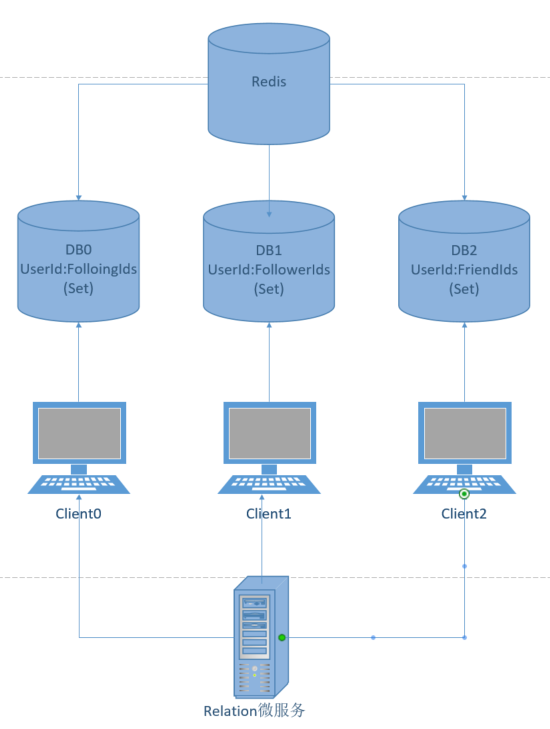

## 抖音项目服务端简单示例

具体功能内容参考飞书说明文档
https://bytedancecampus1.feishu.cn/docx/ZrYxdIIYRonQe4xTD45caEvznXd

## TODO
1. redis mq之间更新
2. mq 防止消费者重复消费
3. mq 存入数据库防止消息丢失
4. 启动ack机制
5. 各种参数校验
6. redis分片实现videoId为key存的userId set， 解决大key问题

## redis设计
### 1. 社交模块
#### 1.1 总体思路
社交模块的主要功能包括：
- 关注|取关用户
- 获取用户朋友列表
- 获取用户关注猎豹
- 获取用户粉丝列表

我们可以采用三种集合，分别用于存储用户的所有粉丝id，用户的所有关注id，用户的所有朋友id，这样在修改或查询用户间关注关系时，只需要对这三个集合进行操作即可。

#### 1.2 数据结构
社交模块的数据结构如下图所示：
<figure>
    
</figure>
可以看到，我们使用了0-2三个数据库，每个数据库中都使用redis的set数据结构来存储1.1中所说的一种集合。这三个set的设计如下：

- DB0: 用户的所有关注id
    - key: userId
    - value: 用户的所有关注id
- DB1: 用户的所有粉丝id
    - key: userId
    - value: 用户的所有粉丝id
- DB2: 用户的所有朋友id
    - key: userId
    - value: 用户的所有朋友id

#### 1.3 业务逻辑
##### （1）基本redis操作
- 集合添加元素：包括向用户的关注/粉丝/朋友集合中添加元素
- 集合删除元素：包括从用户的关注/粉丝/朋友集合中删除元素
- 数据加载操作：从数据库中加载用户的关注/粉丝/朋友集合到redis中
- 数据获取操作：从redis中获取用户的关注/粉丝/朋友的id集合

本项目中，为了实现快速响应，优化用户体验，我们完全采用redis来实现社交模块的所有功能。mysql虽然也会存储用户的关注信息，但是其只用于数据备份以及长期不活跃用户的数据存储（也就是说数据的查询和更新只在redis完成即可，mysql中的数据更新由rmq异步完成）。

为了达到这个目的，我们必须保证在对redis进行操作时：
- redis中必须包含数据库中的数据
- 数据库中的数据和redis中的数据保持一致

为了达到第一个目的，我们在上述的添加/删除/获取操作之前，都会调用一次加载操作，而加载操作会判断当前redis中是否包含数据库中的数据，如果不包含，则会从数据库中加载数据到redis中。

为了达到第二个目的，我们必须保证以下两点：
- redis操作和mq操作必须是同一个事务，两者必须同时成功或同时失败。也就是说，如果redis操作成功，mq操作失败，则需要回滚redis操作，反之亦然。
- redis操作和mq操作必须具备原子性。也就是说在线程A操作redis->mq时，线程B不能操作redis->mq，否则会导致数据不一致，例如下面这种情况：
A操作redis->B操作redis->Bpublish mq消息->Apublish mq消息
##### （2）rpc接口
- 关注/取关用户
直接根据对应的业务逻辑调用redis的添加/删除操作即可
- 获取用户朋友/粉丝/关注列表
直接根据对应的业务逻辑调用redis的获取用户的操作即可